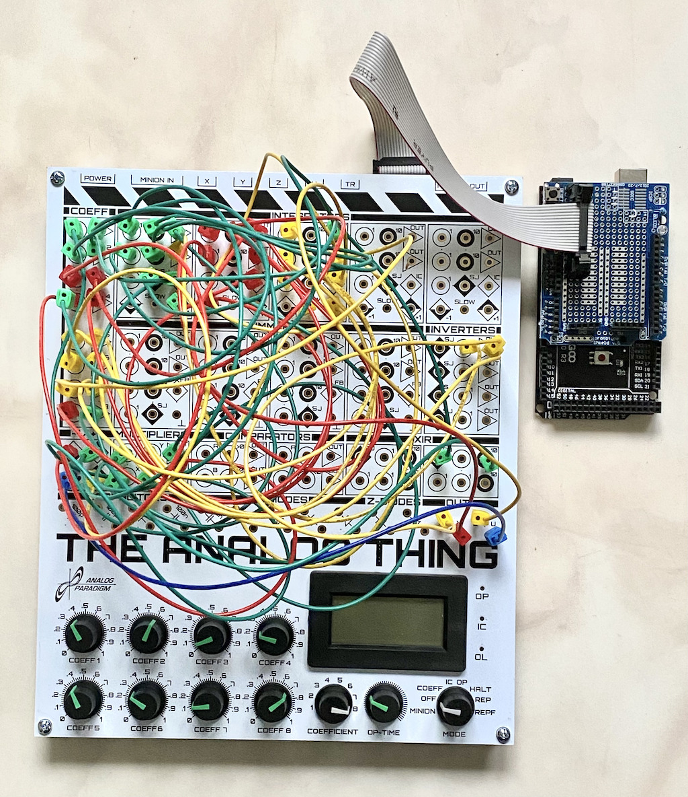

# THAThc
This repository contains an Arduino library as well as build instructions for
A simple Arduino based hybrid controller for THE ANALOG THING.

## Overview
[THE ANALOG THING](https://github.com/anabrid/THAThc) is a small analog 
computer for educational purposes, featuring five integrators, four summers,
four inverters, two multipliers, two comparators, and eight coefficient
potentiometers. It also has a HYBRID port which can be used to connect it 
to a microcontroller such an Arduino Mega 2560 as shown in the following:



To facilitate the use of such a setup a simple Arduino library is provided
which allows to control the analog computer either by an interactive shell 
or under full program control of the microcontroller.

## Hardware
The hybrid port of THE ANALOG THING allows full control over the analog
computer's modes of operation as well as readout of up to four analog 
channels available at the front panel at the X-, Y-, Z-, and U- connections.

Only eight connections must be wired between the Mega 2560 and THE ANALOG
THING as shown in the following table:

|HYBRID port pin|description|Pin on Mega 2560|
|---------------|-----------|----------------|
|2|analog X output|AnalogIn 0|
|4|analog Y output|AnalogIn 1|
|6|analog Z output|AnalogIn 2|
|8|analog U output|AnalogIn 3|
|9 and 10|GND|GND|
|13|enable hybrid mode|D2|
|14|Mode OP|D3|
|16|Mode IC|D4|

These connections were made on a piggy back board as shown in the picture above.
The analog output lines are level compatible due to level shifters on THE
ANALOG THING, so they can be connected directly to the microcontroller.
> [!WARNING]
> Although the hybrid port of THE ANALOG THING also has a pin connected to the 
> +5 V line of the analog computer, do not power it from the +5 V of the 
> Arduino as its power draw is too big for the Arduino to handle.

## Software
The Arduino library for the hybrid controller can be found 
[here](THAThc). It offers an object based interface to the hybrid controller as
shown in the following code example:
```
#include "THAThc.h"
#define BAUD_RATE             250000

void setup() {
  Serial.begin(BAUD_RATE);
  THAThc.begin();
}

void loop() {
  THAThc.shell();
}
```

This example assumes that the library `.h`- and `.cpp`- files reside in the 
same directory as the actual application program. If the library files are 
moved to the appropriate folder in the Arduino environment, the first line
should read `#include <THAThc>`. The call to `THAThc.begin()` in `setup()` 
instantiates a hybrid controller singleton that can then be used in the 
following.

The method `shell()` (called in `loop()`) provides an interactive shell to 
control the analog computer.

### Using the shell
The shell expects simple commands via the serial line interface and is most
easily accessed using the builtin serial monitor of the Arduino IDE which 
must be set to the proper baud rate (default is 250000 baud) and `No line 
ending`.

To control the analog computer the hybrid controller must first be enabled 
by typing `enable`. This deactivates the MODE switch on the front panel of 
THE ANALOG THING. (`disable` will disable the hybrid controller again.)

Simple manual control can be achieved using the commands `ic` (set initial
condition), `op` (run the analog computer), and `halt` (halt the current 
computation). 

Much more interesting, though, are automatic modes such as single or repetitive
run. Single run performs a single cycle of initial condition (IC) and 
operate (OP) with IC- and OP-times controlled by the microcontroller. The 
IC-time is set with `ictime=1` to one millisecond (this is sufficient if all
integrators within a particular setup are running at their highest time scale
factor), while OP-time is set accordingly with a command like `optime=5` to
five milliseconds.

Issuing a `run` command will perform a single IC/OP-cycle. In this mode it 
is possible to automatically collect data from the analog computer run and 
export it for further processing. The following example session shows how 
this is done:
```
enable
ictime=1
optime=5
arm
run
read
```
The first three commands are self explanatory. `arm` arms the data logger which
will start when the analog computer is switched to OP mode. `run` performs a 
single run with the specified IC- and OP-times. `read` reads the data gathered
by the data logger.

Due to the rather slow analog-digital-converters of the Arduino (things could
be sped up by modifying the corresponding timer/counter settings) there is a 
minimum sample interval of 110 microseconds imposed. For longer OP-times the
sampling interval is automatically set based on the OP-time and the available
memory for the data logger (2048 entries). 

By default only one data channel is sampled (connected to the X-jack on the 
patch panel). If, e.g., four channels (the maximum) are to be sampled this
can be set by `channels=4` before arming the data logger.

In some cases only the value(s) at the end of an analog computer run are of 
interest. In this case the ADC channels can be sampled once with the command
`sample`.

`rep` will repeat IC/OP cycles with the times set with `ictime=` and 
`optime=`. This mode is especially useful to produce pictures on an attached
oscilloscope.
> [!NOTE]
> Data cannot be gathered during repetitive runs. 

`status` returns some basic status information about the hybrid controller
settings, while `help` will display some basic information on the available
commands.

### Automatic control of the analog computer
As useful as the shell is, some problems require more intricate control of
the analog computer. Basically this is possible with the shell, too, sending
commands via the serial line and listening for answers but the unaviodable
latencies caused by the USB communication slow things down considerably.

Accordingly, the THAThc-library offers all of the shell commands as callable
methods, thus making it possible to implement a "real" hybrid computer setup.

The following example shows how these methods are used in an actual problem:
THE ANALOG THING in this case gets some external input and is run repeatedly,
with data being gathered after each single run and printed to the serial 
console from where it can be copied for further processing.
```
#include "THAThc.h"
#define BAUD_RATE             250000

void setup() {
  Serial.begin(BAUD_RATE);
  THAThc.begin();
}

void loop() {
  THAThc.enable();            // Configure the hybrid controller
  THAThc.set_ic_time(1);
  THAThc.set_op_time(2);
  THAThc.set_channels(1);

  // Perform repetitive runs and sample result at the end of each run
  for (unsigned long i = 0; i < 2000; i++) {
    THAThc.single_run();
    THAThc.block();

    // We are only interested in the last value of the time integration
    float result;
    THAThc.sample_adc(&result);
    Serial.print(String(i) + "\t");
    Serial.print(result, 3);
    Serial.print("\n");
  }

  for( ; ; delay(1000));      // Stop
}
```
After instantiating the THAThc singleton, the hybrid controller is enabled,
and IC- and OP-times are set to one and two milliseconds. Since in this case
only one ADC channel is of interest, this, too, is set explicitly for good
measure.

The individual IC/OP cycles are performed 2000 times within the central 
`for`-loop. Since the actual timing control of the hybrid controller is done
by hardware timers, methods such as `single_run()` immediately return as an 
internal state machine takes care of the actual analog computer control. 
Calling `block()` actively waits for the termination of the current run before
progressing.

After each IC/OP cycle the result of the analog computation is read by 
invoking `sample_adc(&result)`. This method expects a pointer to an array of
floats (one two four elements, depending on the number of channels to be 
sampled). The result is then printed with three places of precision. This 
data can then be copied from the window of the serial monitor being part of 
the Arduino IDE for further processing.

At the end of this `for`-loop the microcontroller is "halted" in a rather ugly
way but there is nothing more for it to do.

### THAThc methods:
`arm()` arms the data logger which will be activated during the next
single run.

`begin()` initializes the hybrid controller library.

`block()` waits for the termination of the current single run.

`disable()` disables the hybrid controller (this also activates the manual
control on the front panel of the analog computer).

`enable()` enables the hybrid controller (this in turns deactivates the manual
control on the front panel of the analog computer).

`halt()` halts the analog computer, i.e., the integrators stop and hold their
last value (over time they will drift, so HALT mode should not be used for 
extended periods of time as the values will degrade).

`get_status(char *)` returns the current settings of the hybrid controller
and expects a pointer to a char array to hold this information.

`ic()` sets the analog computer to initial condition mode.

`op()` sets the analog computer to operate mode, i.e., the integrators will
run continuously.

`rep()` initates a sequence of IC/OP cycles. This mode is ideal for displaying
a (more or less flickerfree display on an oscilloscope - depending on the 
IC- and OP-times set previously).
> [!NOTE]
> Changing IC- or OP-times during repetitive mode takes effect immediately! 
> There is no need to halt the computer and change back to repetitive mode
> again.

`sample_adc(float *)` samples one to four of the analog-digital-converters 
once. It expects a pointer to an array of one to four floats where the 
results will be stored.

> [!NOTE]
> `sample_adc_raw(unsigned int *)` works similarly to `sample_adc(...)` but
> without the conversion of the read values to floats. This method should 
> not normally be used.

`unsigned long set_channels(unsigned int)` is called to set the number of
channels used for data gathering.

`unsigned long set_ic_time(unsigned long)` sets the IC-time in milliseconds.

`unsigned long set_op_time(unsigned long)` sets the OP-time in milliseconds.

> [!NOTE]
> `unsigned int set_adc_plus(unsigned int)` and 
> `unsigned int set_adc_minus(unsigned int)` can be used to calibrate the 
> analog digital conversion. The library contains standard values corresponding
> to +1 and -1 on the analog computer which should work fine in most cases.
> If these values are not sufficient, the values +1 and -1 should be patched 
> to the X- and Y-jacks on the analog computer. Then `set_channels(2)` 
> followed by a suitable call to `sample_adc_raw(...)` should be invoked. The
> values returned should then be fed as parameters to these two functions,
> thus overriding the default values in the library.

`shell()` invokes an interactive shell.

`single_run()` executes a single IC/OP cycle with IC- and OP-times as set 
before.


